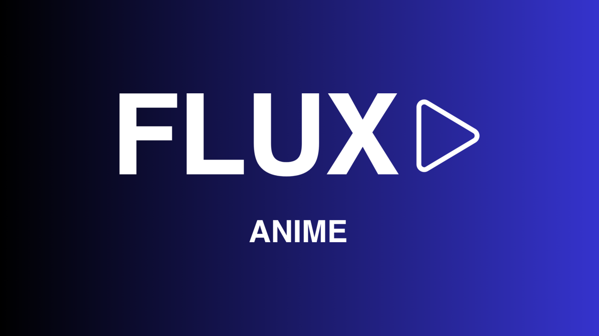

  

  <a href="#english">🇬🇧 English</a> · <a href="#italiano">🇮🇹 Italiano</a>

---

## CODE FOR DOWNLOADER APP 3749174 (FIRESTICK)

---

# FLUX ANIME
FLUX ANIME is a modern, premium streaming application for **anime series and movies**, designed for **Android TV / Fire TV**. Built with Jetpack Compose and Kotlin, it delivers a seamless, cinematic experience on the big screen.

## ✨ Features
- **🍥 Anime Series & Movies:** A dedicated catalog of anime series and films, optimized for the large screens of Android TV and Fire TV.
- **📺 Multi-Platform Optimization:** A single codebase tuned for the 10-foot living-room experience and D-pad navigation.
- **👤 Profile Management:** Personalized user profiles with custom avatars, optional PIN, per-profile watch history, and JSON backup/restore.
- **🎨 Cinematic UI:** A high-end interface featuring radial purple glows, glassmorphism, and smooth focus micro-animations.
- **📡 Powerful Backend Architecture:** Hilt for dependency injection, Retrofit + OkHttp for networking, a dynamic remote BASE_URL, and DataStore for persistent preferences.
- **🔄 OTA Updates:** Built-in over-the-air update check against a remote version.
- **🚀 Performance-First:** Fully built with Jetpack Compose for a responsive, battery-efficient experience.

## 🛠️ Tech Stack
- **UI Framework:** [Jetpack Compose](https://developer.android.com/compose) & [Compose for TV](https://developer.android.com/tv/compose)
- **Programming Language:** [Kotlin](https://kotlinlang.org/)
- **Dependency Injection:** [Dagger Hilt](https://dagger.dev/hilt/)
- **Network Layer:** [Retrofit](https://square.github.io/retrofit/) & [OkHttp](https://square.github.io/okhttp/)
- **Image Loading:** [Coil](https://coil-kt.github.io/coil/)
- **Persistence:** [Jetpack DataStore](https://developer.android.com/topic/libraries/architecture/datastore)
- **Navigation:** [Compose Navigation](https://developer.android.com/jetpack/compose/navigation)

## 🎯 Getting Started
### Prerequisites
- Android Studio Koala or newer.
- JDK 17+.
- Android TV / Fire TV device or emulator with API 28+.

### Installation
1. Just install the APK!

## 💙 Support
If you find this project useful, consider buying me a coffee or making a donation!

 

---

# FLUX ANIME
FLUX ANIME è un'applicazione di streaming moderna e premium per **serie anime e film**, progettata per **Android TV / Fire TV**. Costruita con Jetpack Compose e Kotlin, offre un'esperienza fluida e cinematografica sul grande schermo.

## ✨ Funzionalità
- **🍥 Serie Anime e Film:** Un catalogo dedicato a serie anime e film, ottimizzato per i grandi schermi di Android TV e Fire TV.
- **📺 Ottimizzazione Multi-Piattaforma:** Un unico codebase pensato per l'esperienza da salotto e la navigazione con D-pad.
- **👤 Gestione Profili:** Profili utente personalizzati con avatar custom, PIN opzionale, cronologia visione per profilo e backup/ripristino JSON.
- **🎨 UI Cinematografica:** Un'interfaccia di alto livello con bagliori radiali viola, glassmorphism e micro-animazioni di focus fluide.
- **📡 Architettura Backend Potente:** Hilt per la dependency injection, Retrofit + OkHttp per il networking, BASE_URL remoto dinamico e DataStore per le preferenze persistenti.
- **🔄 Aggiornamenti OTA:** Controllo aggiornamenti over-the-air integrato rispetto a una versione remota.
- **🚀 Performance Prima di Tutto:** Interamente costruita con Jetpack Compose per un'esperienza reattiva ed efficiente.

## 🛠️ Stack Tecnologico
- **UI Framework:** [Jetpack Compose](https://developer.android.com/compose) & [Compose for TV](https://developer.android.com/tv/compose)
- **Linguaggio:** [Kotlin](https://kotlinlang.org/)
- **Dependency Injection:** [Dagger Hilt](https://dagger.dev/hilt/)
- **Network Layer:** [Retrofit](https://square.github.io/retrofit/) & [OkHttp](https://square.github.io/okhttp/)
- **Caricamento Immagini:** [Coil](https://coil-kt.github.io/coil/)
- **Persistenza:** [Jetpack DataStore](https://developer.android.com/topic/libraries/architecture/datastore)
- **Navigazione:** [Compose Navigation](https://developer.android.com/jetpack/compose/navigation)

## 🎯 Per Iniziare
### Requisiti
- Android Studio Koala o più recente.
- JDK 17+.
- Dispositivo/Emulatore Android TV / Fire TV con API 28+.

### Installazione
1. Installa semplicemente l'APK!

## 💙 Supporto
Se trovi questo progetto utile, considera di offrirmi un caffè o fare una donazione!

 
