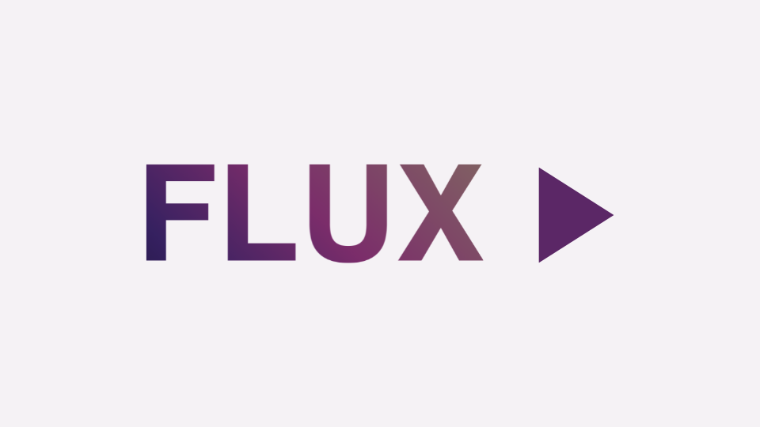

  

  <a href="#english">🇬🇧 English</a> · <a href="#italiano">🇮🇹 Italiano</a>

---

## CODE FOR DOWNLOADER APP 3749174 (FIRESTICK)

---

# FLUX
FLUX is a modern, premium streaming application designed for **Android TV**. Built with Jetpack Compose and Kotlin, it offers a seamless and cinematic experience across all your screens.

## ✨ Features
- **📺 Multi-Platform Optimization:** A single codebase optimized for the large screens of Android TV.
- **👤 Profile Management:** Personalized user profiles with custom avatars and secure access.
- **🎨 Cinematic UI:** A high-end interface featuring radial glows, glassmorphism, and smooth micro-animations.
- **📡 Powerful Backend Architecture:** Uses Hilt for dependency injection, Retrofit for seamless API integration, and DataStore for persistent user preferences.
- **🚀 Performance-First:** Fully built with Jetpack Compose for a responsive and battery-efficient experience.

## 🛠️ Tech Stack
- **UI Framework:** [Jetpack Compose](https://developer.android.com/compose) & [Compose for TV](https://developer.android.com/tv/compose)
- **Programming Language:** [Kotlin](https://kotlinlang.org/)
- **Dependency Injection:** [Dagger Hilt](https://dagger.dev/hilt/)
- **Network Layer:** [Retrofit](https://square.github.io/retrofit/) & [OkHttp](https://square.github.io/okhttp/)
- **Image Loading:** [Coil](https://coil-kt.github.io/coil/)
- **Persistence:** [Jetpack DataStore](https://developer.android.com/topic/libraries/architecture/datastore)
- **Navigation:** [Compose Navigation](https://developer.android.com/jetpack/compose/navigation)

## 🎯 Getting Started
### Prerequisites
- Android Studio Koala or newer.
- JDK 17+.
- Android Device/Emulator with API 28+.

### Installation
1. Just install the APK!

## 💙 Support
If you find this project useful, consider buying me a coffee or making a donation!

 

---

# FLUX
FLUX è un'applicazione di streaming moderna e premium progettata per **Android TV**. Costruita con Jetpack Compose e Kotlin, offre un'esperienza fluida e cinematografica su tutti i tuoi schermi.

## ✨ Funzionalità
- **📺 Ottimizzazione Multi-Piattaforma:** Un unico codebase ottimizzato per i grandi schermi di Android TV.
- **👤 Gestione Profili:** Profili utente personalizzati con avatar custom e accesso sicuro.
- **🎨 UI Cinematografica:** Un'interfaccia di alto livello con bagliori radiali, glassmorphism e micro-animazioni fluide.
- **📡 Architettura Backend Potente:** Usa Hilt per la dependency injection, Retrofit per l'integrazione API e DataStore per le preferenze utente persistenti.
- **🚀 Performance Prima di Tutto:** Interamente costruita con Jetpack Compose per un'esperienza reattiva ed efficiente.

## 🛠️ Stack Tecnologico
- **UI Framework:** [Jetpack Compose](https://developer.android.com/compose) & [Compose for TV](https://developer.android.com/tv/compose)
- **Linguaggio:** [Kotlin](https://kotlinlang.org/)
- **Dependency Injection:** [Dagger Hilt](https://dagger.dev/hilt/)
- **Network Layer:** [Retrofit](https://square.github.io/retrofit/) & [OkHttp](https://square.github.io/okhttp/)
- **Caricamento Immagini:** [Coil](https://coil-kt.github.io/coil/)
- **Persistenza:** [Jetpack DataStore](https://developer.android.com/topic/libraries/architecture/datastore)
- **Navigazione:** [Compose Navigation](https://developer.android.com/jetpack/compose/navigation)

## 🎯 Per Iniziare
### Requisiti
- Android Studio Koala o più recente.
- JDK 17+.
- Dispositivo/Emulatore Android con API 28+.

### Installazione
1. Installa semplicemente l'APK!

## 💙 Supporto
Se trovi questo progetto utile, considera di offrirmi un caffè o fare una donazione!

 
